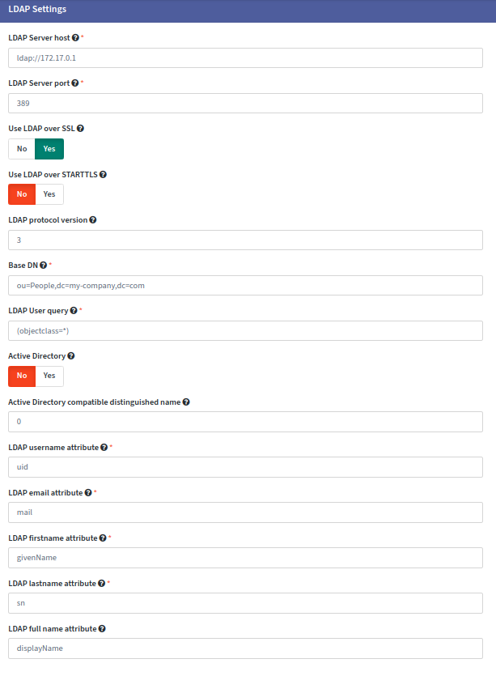

[](LICENSE)
[](https://packagist.org/packages/monogramm/mautic-ldap-auth-bundle)
[](https://travis-ci.org/Monogramm/MauticLdapAuthBundle)
[](https://scrutinizer-ci.com/g/Monogramm/MauticLdapAuthBundle/?branch=master)
[](https://www.mautic.org/mixin/ldapauth/)

# Description - Mautic LDAP Authentication Plugin

This Plugin enables LDAP authentication for mautic 2 and newer, including mautic 5. Even though Mautic offers SAML authentication, the main objective is to offer an alternative to those who do not want to setup SSO in their company just for mautic :smiley:

## Installation
### Composer
This plugin can be installed through composer.

### Manual install
Alternatively, it can be installed manually, following the usual steps:

* Download the plugin
* Unzip to the Mautic `plugins` directory
* Rename folder to `MauticLdapAuthBundle`

-
* In the Mautic backend, go to the `Plugins` page as an administrator
* Click on the `Install/Upgrade Plugins` button to install the Plugin.

OR

* If you have shell access, execute `php bin\console cache:clear` and `php bin\console mautic:plugins:reload` to install the plugins.

## Plugin Activation and Configuration
1. Go to `Plugins` page
2. Click on the `Company Points` plugin
3. ENABLE the plugin

## Configuration
Navigate to the Plugins page and click "Install/Upgrade Plugins". You should now see a "LDAP Auth" plugin.

-   
-   
-   

After activating the plugin, you can now go to "Configuration > LDAP Settings" to edit the parameters:



You can also edit manually your parameters in `local.php` (adapt to your LDAP configuration):
```php
    //'parameters' => array(
    // ...
        'ldap_auth_host' => 'ldap.mysupercompany.com',
        'ldap_auth_port' => 389,
        'ldap_auth_version' => 3,
        'ldap_auth_ssl' => false,
        'ldap_auth_starttls' => true,
        'ldap_auth_base_dn' => 'ou=People,dc=ldap,dc=mysupercompany,dc=com',
        'ldap_auth_user_query' => '(objectclass=inetOrgPerson)',
        'ldap_auth_username_attribute' => 'uid',
        'ldap_auth_email_attribute' => 'mail',
        'ldap_auth_firstname_attribute' => 'givenname',
        'ldap_auth_lastname_attribute' => 'sn',
        'ldap_auth_fullname_attribute' => 'displayname',
        'ldap_auth_isactivedirectory' => false,
    // ...
```

A sample configuration for Active Directory is 
```php
    //'parameters' => array(
    // ...
        'ldap_auth_host' => 'ad.mysupercompany.com',
        'ldap_auth_port' => 389,
        'ldap_auth_version' => 3,
        'ldap_auth_ssl' => false,
        'ldap_auth_starttls' => false,
        'ldap_auth_base_dn' => 'cn=Users,dc=ad,dc=mysupercompany,dc=com',
        'ldap_auth_user_query' => '(objectclass=user)(memberof=marketing)',     // careful this can be case sensitive!
        'ldap_auth_username_attribute' => 'samaccountname',                     // this is case sensitive!
        'ldap_auth_email_attribute' => 'mail',
        'ldap_auth_firstname_attribute' => 'givenname',
        'ldap_auth_lastname_attribute' => 'sn',
        'ldap_auth_fullname_attribute' => 'displayname',
        'ldap_auth_isactivedirectory' => true,
        'ldap_auth_activedirectory_domain' => 'ad.mysupercompany.com',
    // ...
```

Once the parameters are set, open a new browser and check connection through LDAP. **Do not log out until LDAP configuration is valid!**

## Developments in progress

* Test LDAP Authentication settings
* LDAP bind account and Group management

## Contributing

Ideas and suggestions are welcome. Feel free to create an issue or PR on Github using our [CONTRIBUTING](CONTRIBUTING.md) guidelines.

## License

See [LICENSE](LICENSE) file.

## Author(s)

* [Monogramm](https://github.com/Monogramm)

## Awesome contributor(s)

* [terdinatore](https://github.com/terdinatore)
